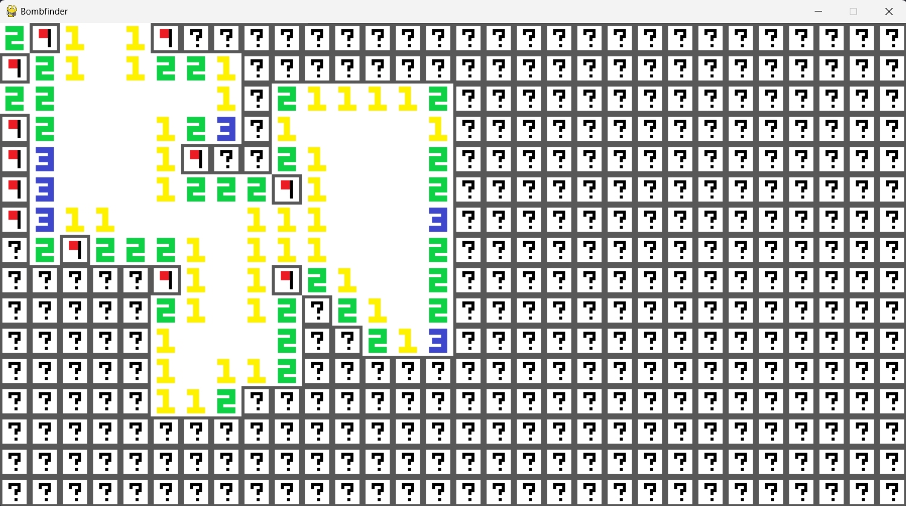

# Bombfinder

Based of the idea of Minesweeper. Created using Python and Pygame. The number of rows, columns and bombs can be changed in the main file.

The project seperates the game logic from the user interface by exporting the game state as a list of enums. This would allow for testing without the user interface or to play the game via another interface such as the terminal.

